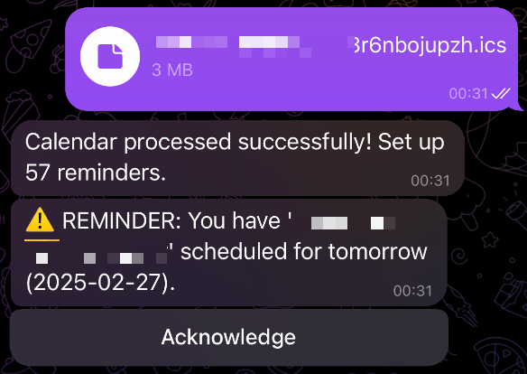

# Calendar Reminder Telegram Bot



A Telegram bot that processes ICS calendar files containing schedule events and sends timely reminders to users, repeating at configurable intervals until they press the "Acknowledge" button so they never miss an event.

> **Note:** This bot was created with a few AI prompts and works for my waste garbage collection calendar. The code quality is questionable. Your experience may vary based on your specific calendar format and requirements.

## Features

- **ICS Calendar Processing**: Upload your calendar file to automatically set up reminders
- **Configurable Reminders**: Receive notifications the day before at your preferred time with customizable follow-up intervals
- **Event Filtering**: Automatically ignores specified events (e.g., "Waste depot closed")
- **Persistent Storage**: Your reminder settings are saved even if the bot restarts
- **User Whitelisting**: Restrict access to specific Telegram users
- **Docker Support**: Easy deployment with Docker and Docker Compose
- **Health Monitoring**: Built-in healthcheck for container orchestration

## Installation

### Prerequisites

- A Telegram bot token (obtained from [@BotFather](https://t.me/BotFather))

### Option 1: Standard Python Installation

1. Clone the repository:
   ```bash
   git clone https://github.com/Elehiggle/calendar-reminder-telegram-bot.git
   cd calendar-reminder-telegram-bot
   ```

2. Install dependencies:
   ```bash
   pip install -r requirements.txt
   ```

3. Create a `.env` file with your configuration:
   ```
   TELEGRAM_BOT_TOKEN=your_bot_token_here
   WHITELIST_USERS=user_id1,user_id2
   IGNORED_TERMS=Waste depot closed||Another term to ignore
   REMINDER_HOUR=17
   REMINDER_MINUTE=0
   REMINDER_INTERVAL_HOURS=2
   TZ=Europe/Brussels
   ```

4. Run the bot:
   ```bash
   python main.py
   ```

### Option 2 (recommended): Docker Installation

1. Clone the repository:
   ```bash
   git clone https://github.com/yourusername/calendar-reminder-telegram-bot.git
   cd calendar-reminder-telegram-bot
   ```

2. Update the `.env` file with your configuration.

3. Build and run with Docker Compose:
   ```bash
   docker-compose up -d
   ```

### Option 3: Direct Docker Container Run

1. Pull and run the container directly:
   ```bash
   docker run -d --name calendar-reminder-telegram-bot \
     -e TELEGRAM_BOT_TOKEN="your_bot_token_here" \
     -e WHITELIST_USERS="user_id1,user_id2" \
     -e IGNORED_TERMS="Waste depot closed||Another term to ignore" \
     -e REMINDER_HOUR="17" \
     -e REMINDER_MINUTE="0" \
     -e REMINDER_INTERVAL_HOURS="2" \
     -e TZ="Europe/Brussels" \
     -v $(pwd)/data:/app/data \
     ghcr.io/elehiggle/calendar-reminder-telegram-bot:latest

## Configuration

### Environment Variables

| Variable | Description | Default | Required |
|----------|-------------|---------|----------|
| `TELEGRAM_BOT_TOKEN` | Your Telegram bot token | - | Yes |
| `WHITELIST_USERS` | Comma-separated list of allowed user IDs | Empty (allows all) | No |
| `IGNORED_TERMS` | Terms to ignore in events, separated by `\|\|` | Wertstoffhof geschlossen | No |
| `DATA_PATH` | Directory to store user data, use this if you are not in a Docker environment and do not want the data directory in your current folder | ./data | No |
| `REMINDER_HOUR` | Hour of the day (0-23) for the initial reminder | 17 (5 PM) | No |
| `REMINDER_MINUTE` | Minute (0-59) for the initial reminder | 0 | No |
| `REMINDER_INTERVAL_HOURS` | Hours between follow-up reminders | 2 | No |
| `TZ` | Your desired time zone. [click](https://en.wikipedia.org/wiki/List_of_tz_database_time_zones#List) | System time zone | No |

## Usage

### Bot Commands

- `/start` - Initialize the bot
- `/help` - Display help information
- `/list` - Show all your upcoming reminders
- `/clear` - Delete all your reminders

### Setting Up Reminders

1. Start a chat with your bot on Telegram
2. Send the `/start` command
3. Upload your ICS calendar file containing events
4. The bot will automatically process the calendar and set up reminders
5. You'll receive reminders the day before each event at your configured time
6. Additional reminders will be sent at your configured interval until the event
7. Press "Acknowledge" on any reminder to stop further notifications for that specific event

## Finding Your Telegram User ID

To add yourself to the whitelist, you need to know your Telegram user ID:

1. Start a chat with [@userinfobot](https://t.me/userinfobot) on Telegram
2. The bot will reply with your user ID
3. Add this ID to the `WHITELIST_USERS` environment variable

## Contributing

Contributions are welcome! Please feel free to submit a Pull Request.

## License

This project is licensed under the MIT License - see the LICENSE file for details.

## Acknowledgments

- [python-telegram-bot](https://github.com/python-telegram-bot/python-telegram-bot) library
- [icalendar](https://github.com/collective/icalendar) library for parsing ICS files